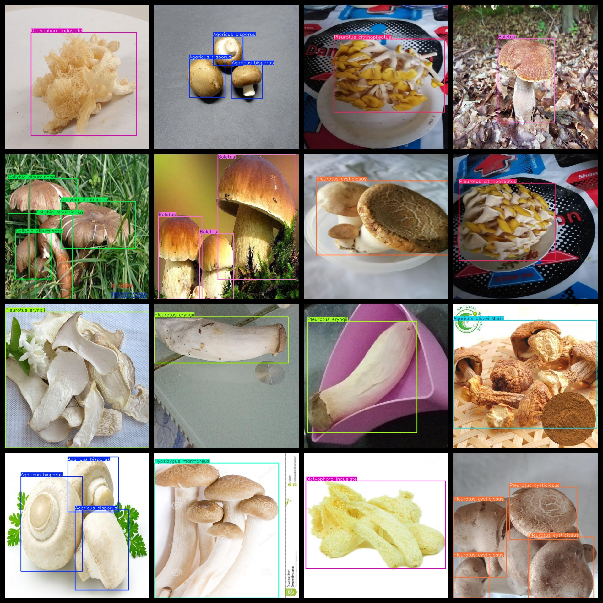
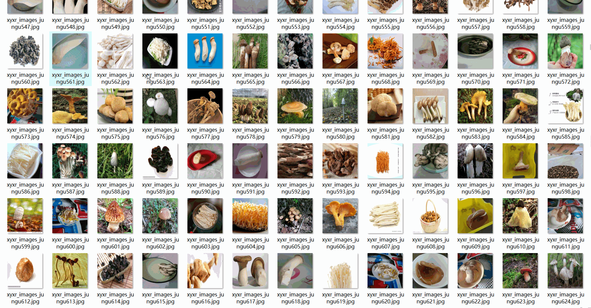

# 21 types Mushroom Detection Dataset 4040 Images VOC+YOLO format

The 21-species mushroom detection dataset consists of 40,400 images in VOC+YOLO format.

Dataset Format: Pascal VOC + YOLO (excluding the split-path txt file; only jpg images with corresponding VOC-format xml files and YOLO-format txt files)

Number of images (jpg file count): 4040

Number of XML files: 4040

Number of txt files: 4040

Category count: 21

The Github repository is: datasets_sl

["Agaricus bisporus", "Agaricus blazei Murill", "Agrocybe aegerita", "Armillaria mellea", "Auricularia auricula", "Boletus", "Cantharellus cibarius", "Clitocybe maxima", "Collybia albuminosa", "Coprinus comatus", "Cordyceps militaris", "Dictyophora indusiate", "Flammulina velutiper", "Hericium erinaceus", "Hypsizygus marmoreus", "Lentinus edodes", "Morchella esculenta", "Pleurotus citrinopileatus", "Pleurotus cystidiosus", "Pleurotus eryngii", "Pleurotus ostreatus"]

Tag Chinese Translation: Bacillus, Brassica mushroom, tea tree mushroom, honey fungus, black fungus, boletus mushroom, chicken of the sea mushroom, gigantic mouth mushroom, protein money fungus, woolly head fungus, cordyceps, long skirt bamboo fungus, golden needle fungus, hericium mushroom, shiitake mushroom, crab fungus, shiitake mushroom, porcini mushroom, wood ear mushroom, cypress yellow fungus, artemisia moelleriana, aurantiolum mushroom, oyster mushroom, enoki mushroom, shrimp fungus

Number of boxes labeled in each category:

Agaricus bisporus frame count = 521

Agaricus blazei Murill frame count = 307

Agrocybe aegerita frame count = 197

Armillaria mellea frame count = 290

Auricularia auricula frame count = 346

Boletus frame count = 451

Cantharellus cibarius frame count = 439

Clitocybe maxima frame count = 380

Collybia albuminosa frame count = 692

Coprinus comatus frame count = 533

Cordyceps militaris frame count = 379

Dictyophora indusiate frame count = 483

Flammulina velutiper frame count = 238

Hericium erinaceus frame count = 600

Hypsizygus marmoreus frame count = 277

Lentinus edodes frame count = 1216

Morchella esculenta frame count = 509

Pleurotus citrinopileatus frame count = 241

Pleurotus cystidiosus frame count = 321

Pleurotus eryngii frame count = 322

Pleurotus ostreatus frame count = 253

Total frame count: 8995

Number of images per category:

Agaricus bisporus has 161 images.

Agaricus blazei Murill has 137 images.

Agrocybe aegerita has 179 images.

Armillaria mellea has 200 images.

Auricularia auricula has 200 images.

Boletus has 213 images.

Cantharellus cibarius has a total of 216 images.

Clitocybe maxima has 219 images.

Collybia albuminosa occupies 165 images.

Coprinus comatus has 173 pictures.

Cordyceps militaris possesses 200 images.

Dictyophora indusiate occupies = 205

Flammulina velutiper has 187 images.

Hericium erinaceus has 207 images.

Hypsizygus marmoreus has 179 images.

Lentinus edodes has 219 pictures.

Morchella esculenta occupies 197 images.

Pleurotus citrinopileatus has a total of 201 images.

Pleurotus cystidiosus has 195 images.

Pleurotus eryngii has 193 images.

Pleurotus ostreatus has 197 pictures.

Image resolution: 640x640
## Images

---

Here is a pay link on Stripe (https://buy.stripe.com/3cs8yP7sY87d0vu9AB). Please contact me lonlonago@foxmail.com after funding $89, and I will send you a complete data files, thank you!

